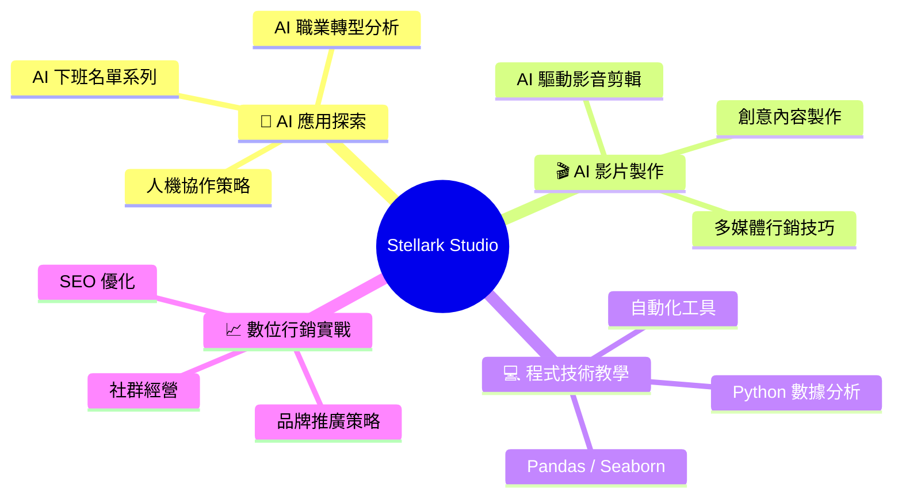
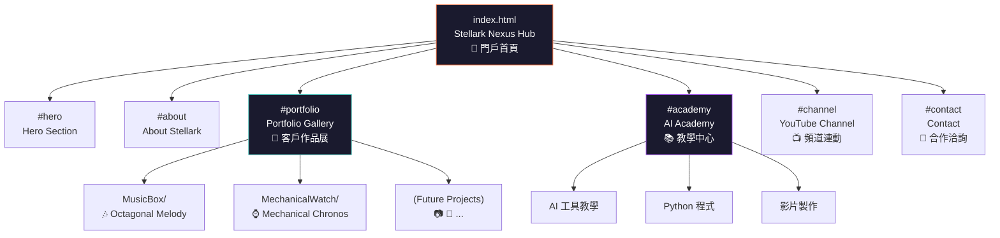

# 🌙 星月樞紐展訊 — Stellark Nexus Hub
## Implementation Plan v1.0 | 2026-05-13

> [!IMPORTANT]
> **融合方案**：提案二【星月樞紐展訊】作品集導向 + 提案一【數位煉金術師】AI 教學賦能
> **最終目標**：成為「星月 AI x 生活 工作室 Stellark AI x Life Studio」的官方網站

---

## 1. 🔬 頻道深度分析 (Channel Intelligence Report)

### 品牌核心 DNA

| 維度 | 分析結果 |
|:---|:---|
| **品牌名稱** | 星月 AI x 生活 工作室 / Stellark AI x Life Studio |
| **Handle** | @Stellark-AI2025 |
| **規模** | 69 位訂閱者 · 170 部影片 (成長型頻道) |
| **聯絡** | stellark0220@gmail.com |
| **品牌色系** | 🟠 星際橘 + 🔵 宇宙藍 + 🌙 月光銀 + ⚫ 深空黑 |
| **Logo 意象** | 星月合一 — 橘色星球 + 藍色月牙 + "STL" 字母標記 |
| **Banner 風格** | 科技感電路板紋理 + 霓虹光環 + 行星系統 |

### 四大內容支柱 (Content Pillars)



### 品牌定位語
> *「如同夜空中閃耀的星辰與皎潔的月光相遇，Stellark 是一艘承載科技夢想的方舟」*

---

## 2. 🏗️ 網站架構 (Site Architecture)

### Hub & Spoke 模式 (Xavier 架構決策)



### 單頁式長捲動 (Single Page Application)

所有內容整合在一個 `index.html` 中，透過平滑捲動與導航列在各區塊間切換。子項目（MusicBox、MechanicalWatch）保留為獨立頁面（Spoke）。

---

## 3. 🎨 設計系統 (Design System Specification)

### 色彩系統 — 取自品牌 Banner

```css
/* Stellark Color Palette */
--stellar-orange: #ff6b35;      /* 星際橘 — 主要強調色 */
--stellar-orange-glow: rgba(255, 107, 53, 0.3);
--cosmic-blue: #1e90ff;         /* 宇宙藍 — 次要強調色 */
--cosmic-blue-glow: rgba(30, 144, 255, 0.2);
--moonlight-silver: #c8d6e5;    /* 月光銀 — 文字/邊框 */
--deep-void: #030305;           /* 深空黑 — 背景 */
--nebula-dark: #0a0a1a;         /* 星雲暗 — 卡片背景 */
--accent-gold: #f0c040;         /* 點綴金 — 特殊標記 */
```

### 字體選擇 (避開 SKILL.md 禁用的通用字體)

| 用途 | 字體 | 理由 |
|:---|:---|:---|
| **Display/Hero** | `'Playfair Display'` | 奢華感、高辨識度、強烈視覺錨點 |
| **Body/UI** | `'DM Sans'` | 現代幾何感、清爽、不俗套 |
| **Code/Tech** | `'JetBrains Mono'` | 工程專業感、教學區段使用 |

### 關鍵視覺效果

- **Glassmorphism 2.0**：延續 Trinity Showcase 的玻璃擬態，升級為帶橘色/藍色邊框光暈
- **Orbital Particle System**：粒子系統從線性上升改為圍繞中心軌道運行（呼應星月主題）
- **Scroll-triggered Reveals**：各區塊滾入時帶有交錯式漸入動畫
- **Neon Glow Borders**：卡片 hover 時產生橘色 → 藍色的漸變發光

---

## 4. 📐 六大區塊設計 (Section Blueprint)

### Section 1: Hero 🌙
- **全螢幕沉浸式**，深空背景搭配軌道粒子
- 星月 Logo（使用頻道大頭貼或 SVG 重繪）
- 主標題：`星月 AI x 生活 工作室`
- 副標題：`Stellark AI x Life Studio`
- 品牌金句動態打字效果
- CTA 按鈕：「探索作品」「開始學習」

### Section 2: About Stellark ✨
- 簡介星月的品牌故事與使命
- 三個核心能力卡片：
  1. 🎨 **數位設計** — 為客戶打造沉浸式網站
  2. 🤖 **AI 賦能** — AI 工具教學與影片製作
  3. 💻 **程式教學** — Python / 數據科學實戰

### Section 3: Portfolio Gallery 🎨 (提案二核心)
- **Masonry/Grid 佈局**的作品展示
- 每個作品卡包含：
  - 預覽截圖（或 iframe 嵌入）
  - 專案名稱與技術標籤
  - Status badge (Live / Concept)
  - 點擊進入獨立展示頁
- 現有作品：
  - 🎶 Octagonal Melody (MusicBox)
  - ⌚ Mechanical Chronos (MechanicalWatch)
- 預留未來擴充

### Section 4: AI Academy 📚 (提案一核心)
- **課程分類卡片**：
  1. 🤖 **AI 工具應用** — Gemini、ChatGPT、Midjourney 等
  2. 🎬 **AI 影片製作** — 從腳本到成片的 AI 工作流
  3. 🐍 **Python 程式** — 數據分析、自動化、爬蟲
  4. 📈 **數位行銷** — SEO、社群經營、品牌策略
- 每張卡片包含：課程圖示、簡介、「觀看教學 →」連結
- **學習路徑圖**：互動式的技能樹展示

### Section 5: YouTube Channel 📺
- 嵌入最新 3 支影片（YouTube iframe embed）
- 頻道數據展示（69 訂閱者 · 170 部影片）
- 訂閱 CTA 按鈕（連結到 YouTube 頻道）
- 「AI 下班名單」系列精選區

### Section 6: Contact & Footer 📩
- 合作洽詢表單或 mailto 連結
- 社群連結（YouTube、Email）
- 品牌 Footer：`Engineered by Stellark Studio • Powered by UTT v2.0`

---

## 5. 📁 檔案結構 (File Structure)

```
d:\AntiG\Web_26M4\
├── index.html              ← 重寫為 Stellark Nexus Hub
├── style_hub.css            ← 重寫：完整設計系統
├── app_hub.js               ← 重寫：導航、動畫、粒子系統
├── MusicBox/                ← 保留（作品集 Spoke）
│   ├── musicbox.html
│   ├── style.css
│   └── app.js
├── MechanicalWatch/         ← 保留（作品集 Spoke）
│   ├── watch.html
│   ├── watch_style.css
│   └── watch_app.js
└── .agents/skills/          ← 保留
```

> [!NOTE]
> 三個主檔案 (`index.html`, `style_hub.css`, `app_hub.js`) 將被完全重寫。
> MusicBox 和 MechanicalWatch 子專案保持不動（只是被 Portfolio 區引用）。

---

## 6. 🚀 建造階段 (Build Phases)

### Phase 1: 基礎架構 (Foundation)
1. 重寫 `style_hub.css` — 完整設計系統、CSS 變數、動畫
2. 重寫 `index.html` — 六大區塊 HTML 結構
3. 重寫 `app_hub.js` — 導航、粒子系統、捲動動畫

### Phase 2: 打磨細節 (Polish)
4. 微動畫、hover 效果、滾動觸發
5. 響應式設計（手機 / 平板 / 桌面）
6. SEO meta tags、Open Graph

### Phase 3: 內容填充 (Content)
7. YouTube 嵌入整合
8. 教學課程卡片內容
9. 作品集截圖與連結

---

## 7. ❓ 待 Commander 確認事項

> [!WARNING]
> 以下問題需要您的決策後才能開工：

1. **Logo 處理**：是否使用頻道的星月 Logo 圖片檔？還是我用 CSS/SVG 重新繪製一個？
2. **YouTube 嵌入**：是否要嵌入實際的 YouTube iframe？還是先用視覺模擬？
3. **教學內容**：AI Academy 的課程卡片，目前先用概念文案？還是您有具體的課程/播放清單連結？
4. **Contact**：合作洽詢使用 `stellark0220@gmail.com` 的 mailto 連結即可？
5. **是否立即開工**？確認後我將按 Phase 1 → 2 → 3 的順序全速推進。

---

*Designed by Victor (VPD) · Architected by Xavier (XSS) · Strategized by Charles (CS)*
*星月 AI x 生活 工作室 — 讓科技點亮你的未來 🌙✨*
